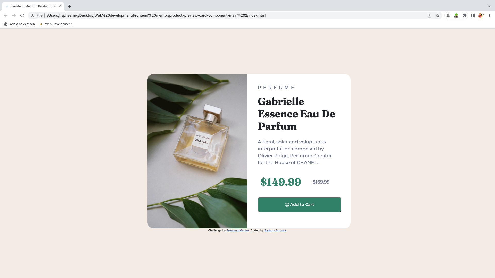

# Frontend Mentor - Product preview card component solution

This is a solution to the [Product preview card component challenge on Frontend Mentor](https://www.frontendmentor.io/challenges/product-preview-card-component-GO7UmttRfa). Frontend Mentor challenges help you improve your coding skills by building realistic projects. 

## Table of contents

- [Overview](#overview)
  - [The challenge](#the-challenge)
  - [Screenshot](#screenshot)
  - [Links](#links)
- [My process](#my-process)
  - [Built with](#built-with)
  - [What I learned](#what-i-learned)
  - [Continued development](#continued-development)
- [Author](#author)

## Overview

Product preview card component (desktop and mobile design).

### The challenge

Users should be able to:

- View the optimal layout depending on their device's screen size
- See hover and focus states for interactive elements

### Screenshot

### Links

- Solution URL: https://github.com/BarboraBrhlova/product-preview-card-component
- Live Site URL: https://barborabrhlova.github.io/product-preview-card-component

## My process

### Built with

- Semantic HTML5 markup
- CSS custom properties
- Flexbox
- CSS Grid

### What I learned

I learnd how to use @media component in CSS. And also tried to work with Bootstrap 5.

### Continued development

I am still not completely comfortable with some of Bootstrap's techniques (container, grid,etc.).

- [Bootstrap 5](https://getbootstrap.com/docs/5.3/getting-started/introduction/)
- [W3schools](https://www.w3schools.com/)

## Author

- Frontend Mentor - [@BarboraBrhlova](https://www.frontendmentor.io/profile/BarboraBrhlova)

